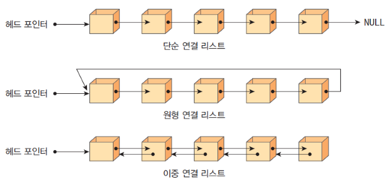
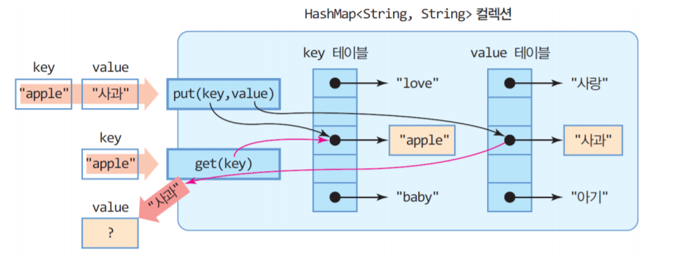
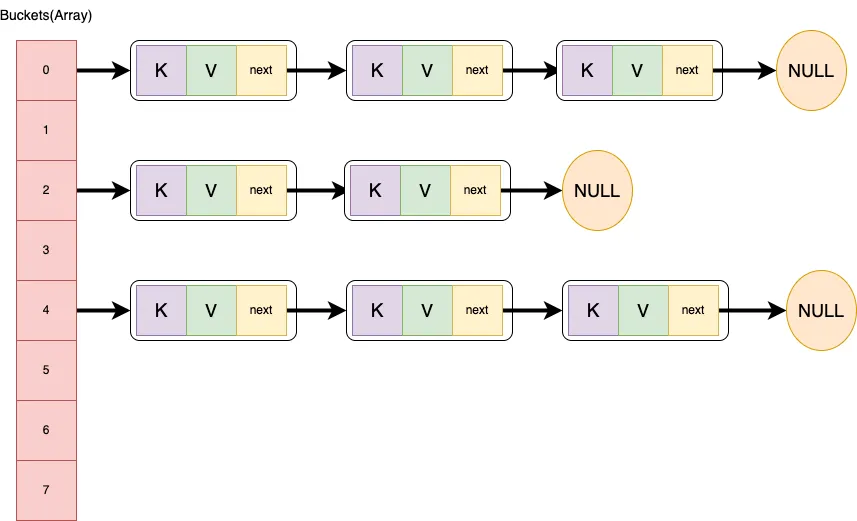

## 1. double linked list란?
- 
#### 각 노드가 앞 뒤 노드에 대한 포인터를 가지고 있어 양방향 탐색이 가능한 리스트 
- 단순 연결 리스트의 경우 삽입, 삭제를 위해 앞 노드에 대한 주소 필요
    - 해당 주소 얻기 위해 처음부터 다시 search해야 하는 비효율성 존재
- 이중 연결 리스트는 각 노드가 prev, next 포인터를 가지고 있어 양방향 탐색 가능
    - 따라서 삽입, 삭제 시 앞 노드뿐만 아니라 뒤 노드에 대한 주소도 알고 있어 효율적으로 삽입, 삭제 가능

## 1-1. double linked list 구성
- head와 tail은 가상의 노드로 실제 데이터 저장 안 함
    - head와 tail 노드를 이중 연결 리스트를 구성하는 골격으로 사용.
    - 초기 이중 연결 리스트 구성 : head <--> tail

## 2. hash map이란?
- 
- key-value 쌍을 저장하는 자료구조로, key를 통해 value에 빠르게 접근 가능 (map 구조)
    - key-value 쌍 형태의 저장 방식인 map을 구현한 것.
    - key는 중복 저장될 수 없음
    - 동일 키로 put 작업 시 기존 값 대신 새로운 값으로 대체

- hash function을 통해 key 값을 해시 값으로 변환하여 배열의 인덱스로 사용
    - map 객체가 저장될 위치를 hash function을 통해 결정.
    - 단 키가 다름에도 hash function이 같은 인덱스를 반환할 경우 해시 충돌 (collision) 발생

## 2-1. 충돌(collision) 해결방안 chained hashing
- 
- 같은 hash 값을 가지는 key-value 쌍들을 linked list 형태로 관리
    - 1차원 배열형태 bucket에 linked list 형태의 데이터를 저장
    - 즉, hash map의 index에 해당하는 bucket에 linked list가 저장되는 방식
    - 충돌이 발생한다면 동일 bucket에 linked list를 연결하는 방식으로 해결 가능